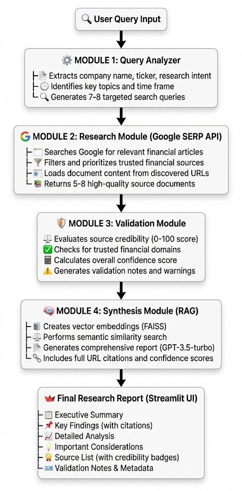

# 📊 Modular Equity Research System

> An AI-powered equity research platform that leverages specialized LLM modules and real-time data to generate comprehensive financial analysis reports.

[](https://www.python.org/downloads/)
[](https://streamlit.io)
[](https://langchain.com)
[](https://opensource.org/licenses/MIT)

---

## 🎯 Overview

The **Modular Equity Research System** is a prototype application that automates financial equity research using a coordinated multi-module architecture. It combines the power of OpenAI's GPT-3.5-turbo, SERPER API for google search, and RAG (Retrieval-Augmented Generation) to deliver accurate, well-sourced financial analysis reports with confidence scoring.

### Key Features

- **🔍 Intelligent Query Analysis**: Automatically extracts company information, research intent, and relevant topics from natural language queries
- **🌐 Dynamic Source Discovery**: Uses SERPER API to find the most relevant, up-to-date financial articles and reports
- **✅ Automated Validation**: Evaluates source credibility and calculates confidence scores for research findings
- **📝 RAG-Powered Synthesis**: Generates comprehensive reports using vector-based semantic search and LLM synthesis
- **📊 Real-time Activity Logging**: Transparent pipeline execution with detailed activity tracking


## 🏗️ Architecture

### System Design

The system follows a **modular pipeline architecture** where specialized components work in coordination to process research queries:



### Technology Stack

#### **Core Framework**
- **Streamlit** (1.39.0) - Web application framework
- **Python** (3.11+) - Primary programming language

#### **LLM & AI**
- **LangChain** (0.3.7) - LLM application framework
- **LangChain-OpenAI** (0.2.9) - OpenAI integration
- **OpenAI GPT-3.5-turbo** - Language model for analysis and synthesis

#### **Vector Store & Embeddings**
- **FAISS** (1.9.0) - Vector similarity search
- **OpenAI Embeddings** - Text vectorization

#### **Data Sources**
- **Google Serper API** - Real-time web search
- **LangChain Document Loaders** - Web scraping and parsing

#### **Additional Libraries**
- **BeautifulSoup4** - HTML parsing
- **python-dotenv** - Environment variable management
- **Requests** - HTTP client

---

## 📁 Project Structure

```
modular-equity-research-system/
│
├── modules/                   # Core processing modules
│   ├── __init__.py
│   ├── query_analyzer.py      # Query analysis & structuring
│   ├── research_module.py     # Source discovery & loading
│   ├── validation_module.py   # Source validation & scoring
│   └── synthesis_module.py    # Report generation (RAG)
│
├── utils/                     # Utility functions
│   ├── __init__.py
│   ├── embeddings.py          # Vector store management
│   └── logger.py              # Activity logging
│
├── config.py                  # Configuration settings
├── app.py                     # Streamlit web application
├── requirements.txt           # Python dependencies
├── .env                       # Environment variables (gitignored)
├── .gitignore                 # Git ignore rules
└── README.md                  # This file
```

### Module Descriptions

#### **1. Query Analyzer** (`query_analyzer.py`)
Processes natural language queries to extract structured information:
- Company name and stock ticker
- Research intent (earnings, valuation, competition, etc.)
- Key topics to investigate
- Time frame of interest
- Generated search queries for discovery

**Input**: Natural language query  
**Output**: Structured JSON with company info and search strategies

---

#### **2. Research Module** (`research_module.py`)
Discovers and loads relevant financial content:
- Uses Google SERP API for dynamic source discovery
- Filters for trusted financial domains (Reuters, Bloomberg, CNBC, etc.)
- Loads and processes document content
- Falls back to curated sources if API unavailable

**Input**: Query analysis with search queries  
**Output**: List of Document objects with source URLs and content

---

#### **3. Validation Module** (`validation_module.py`)
Evaluates source quality and calculates confidence:
- Assigns credibility scores (0-100) to each source
- Checks against trusted financial domain list
- Calculates weighted overall confidence score
- Generates validation notes and quality indicators

**Input**: Document list  
**Output**: Validation report with scores and trust indicators

---

#### **4. Synthesis Module** (`synthesis_module.py`)
Generates comprehensive reports using RAG:
- Creates FAISS vector store from documents
- Performs semantic similarity search for relevant context
- Uses GPT-3.5-turbo to generate structured reports
- Includes full URL citations in markdown format
- Extracts and formats source metadata

**Input**: Documents, validation report, query  
**Output**: Comprehensive research report with citations

---

## 🚀 Getting Started

### Prerequisites

- **Python 3.11+** install on your system
- **OpenAI API key** (GPT-3.5-turbo access)
- **Serper API key** (for Google search - 100 free searches/month)
- **Git** (for cloning the repository)

### Installation

#### 1. Clone the Repository

```bash
git clone https://github.com/neelagarwal98/modular-equity-research-system.git
```

#### 2. Create Virtual Environment

```bash
# Create virtual environment
python3 -m venv venv

# Activate virtual environment
# On macOS/Linux:
source venv/bin/activate

# On Windows:
venv\Scripts\activate
```

#### 3. Install Dependencies

```bash
pip install --upgrade pip
pip install -r requirements.txt
```

#### 4. Set Up Environment Variables

Create a `.env` file in the project root:

```bash
# Create .env file
touch .env
```

Add your API keys to `.env`:

```env
OPENAI_API_KEY=sk-your-openai-api-key-here
SERPER_API_KEY=your-serper-api-key-here
```

**Where to get API keys:**
- **OpenAI**: https://platform.openai.com/api-keys
- **Serper**: https://serper.dev (100 free searches/month)

#### 5. Verify Installation

```bash
# Test that all packages are installed
python -c "from langchain_openai import ChatOpenAI; from langchain_community.utilities import GoogleSerperAPIWrapper; print('✅ All packages installed successfully!')"
```

---

## 💻 Usage

### Running the Application

```bash
streamlit run app.py
```

The application will open in your browser at `http://localhost:8501`

### Example Queries

Try these sample queries to test the system:

**Basic Company Analysis:**
```
Analyze Apple's recent financial performance
```

**Competitive Analysis:**
```
Compare Tesla vs Rivian in the EV market
```

**Earnings Research:**
```
What were NVIDIA's Q3 2024 earnings results?
```

**Investment Outlook:**
```
Is Microsoft a good investment right now?
```

**Sector Analysis:**
```
How is the semiconductor industry performing?
```

### Using the Interface

1. **Enter Query**: Type your research question in the text area
2. **Select Mode**: 
   - **Autonomous**: AI finds sources automatically (recommended)
   - **Manual**: Provide your own URLs for analysis
3. **Start Research**: Click the "Start Research" button
4. **Monitor Progress**: Watch the activity log in the sidebar
5. **Review Report**: Scroll down to see the generated report with:
   - Executive summary
   - Key findings with citations
   - Detailed analysis
   - Source list with quality indicators
   - Validation notes

---

## ⚙️ Configuration

### Key Settings (`config.py`)

```python
# Model Configuration
LLM_MODEL = "gpt-3.5-turbo"          # LLM model to use
LLM_TEMPERATURE = 0.3                # Lower for more factual
MAX_TOKENS = 1000                    # Max tokens per response

# Research Parameters
MAX_SOURCES = 5                      # Number of sources to analyze
SERP_SEARCH_LIMIT = 7                # Number of Google searches
SERP_RESULTS_PER_QUERY = 3           # Results per search

# Confidence Thresholds
MIN_CONFIDENCE_SCORE = 0.6           # Minimum acceptable confidence
HIGH_CONFIDENCE_THRESHOLD = 0.8      # High confidence threshold
```

### Customization Options

**Adjust Source Quality:**
Modify `PRIORITY_DOMAINS` in `config.py` to add/remove trusted sources:

```python
PRIORITY_DOMAINS = [
    "reuters.com",
    "bloomberg.com",
    "wsj.com",
    # can add as per trusted priority
]
```

**Increase Source Count:**
For more comprehensive research:

```python
MAX_SOURCES = 10  # Analyze more sources
```

---

## 📊 Output Format

### Research Report Structure

```markdown
## Research Report

**Company:** NVIDIA Corporation  
**Ticker:** NVDA  
**Confidence:** 85.3%  
**Sources:** 5

### Executive Summary:
[2-3 sentence overview with key takeaways]

### Key Findings:
• Finding 1 with data [Source: full-url.com](full-url.com)
• Finding 2 with metrics [Source: another-url.com](another-url.com)
• Finding 3 with analysis [Source: third-url.com](third-url.com)

### Detailed Analysis:
[2-3 paragraphs with in-depth analysis and data]

### Important Considerations:
• Risk factor 1
• Limitation 1
• Market dynamic 1

### Sources:
1. [reuters.com: nvidia q3 earnings](url) 🟢 High Quality (95/100)
2. [cnbc.com: nvidia ai demand](url) 🟢 High Quality (90/100)

### Validation Notes:
✅ 5 source(s) from trusted financial sites
⭐ 4 high-quality source(s) found
```

---

## 🎨 Features in Detail

### 1. Real-time Activity Logging
- Tracks all module operations in sidebar
- Shows complete research pipeline execution
- Color-coded status indicators (✅ ⚠️ ❌)
- Expandable details for debugging

### 2. Source Validation
- Trusted domain checking
- Content quality analysis
- Weighted confidence calculations

### 3. RAG-Powered Synthesis
- FAISS vector similarity search
- Semantic context retrieval
- GPT-3.5-turbo for coherent synthesis
- Inline URL citations in markdown format

### 4. Confidence Scoring
- Source-level credibility scores
- Overall weighted confidence
- Trust ratio calculations
- Visual confidence indicators

---

### Areas for Improvement

- [ ] Add support for PDF report export
- [ ] Implement query caching
- [ ] Add support for more LLM providers (Anthropic, Cohere)
- [ ] Enhance source validation with ML models
- [ ] Add historical data tracking
- [ ] Implement user authentication
- [ ] Add support for batch processing

---

## 📄 License

This project is licensed under the MIT License - Neel Agarwal.

---

## 🙏 Key Acknowledgments

- **LangChain** - For LLM application framework
- **Streamlit** - For the intuitive web app framework
- **OpenAI** - For GPT-3.5-turbo API
- **Serper.dev** - For Google search API access
- **FAISS** - For efficient vector similarity search

---

## 📞 Contact & Support

- **Email**: neelagarwal98@gmail.com

---

## 🗺️ Roadmap

### Short-term (v1.1)
- [ ] PDF export functionality
- [ ] Enhanced error handling
- [ ] Query result caching
- [ ] Improved mobile responsiveness

### Mid-term (v1.2)
- [ ] Support for multiple LLM providers
- [ ] Advanced validation with ML
- [ ] Historical tracking dashboard
- [ ] Batch processing mode

### Long-term (v2.0)
- [ ] User authentication system
- [ ] Collaborative research features
- [ ] API endpoint for programmatic access
- [ ] Multi-language support

---

## ⭐ Star History

If you find this project helpful, please consider giving it a star! ⭐

---

**Built using Python, LangChain, OpenAI GPT 3.5 turbo, Google SERP API, FAISS, RAG and Streamlit**

